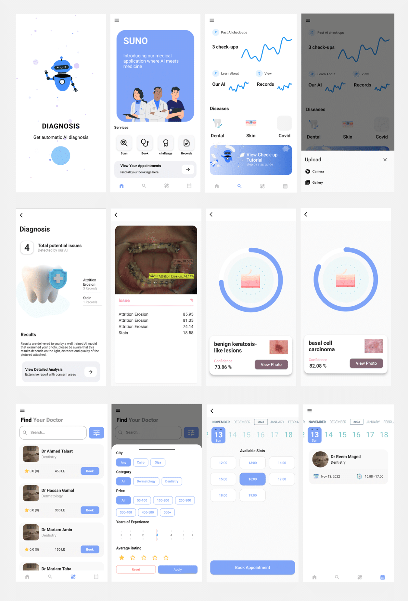

# SUNO: Smartphone Medical Diagnosis
A self-diagnostic Smartphone Mobile application which provides preliminary diagnosis of different types of diseases based on image analysis.
## Models notebooks can be found as 
 - yolo_classifier_skin.ipynb
 - yolov5_dental.ipynb
## Datasets for training can be found in those links 
  - Dental at https://drive.google.com/file/d/14BuUsdciLJHlDYDBLNXmJMWs11Qm_Dp1/view?usp=sharing 
  - Skin at https://drive.google.com/file/d/1--wQ8py8bk9sVLrewC_y6n6CcCkg9_3s/view?usp=sharing
## Preview

